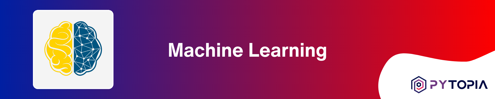
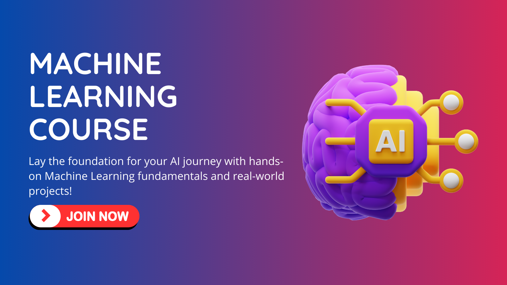

[](https://www.pytopia.ai)
[](https://t.me/pytopia_ai)
[](https://instagram.com/pytopia.ai)
[](https://www.youtube.com/@pytopia)
[](https://linkedin.com/company/pytopia)
[](https://twitter.com/pytopia_ai)

Welcome to the Machine Learning Fundamentals course repository! This comprehensive course is designed to provide you with a solid foundation in the essential concepts, techniques, and algorithms that form the backbone of Machine Learning. Whether you're a beginner taking your first steps into the world of AI or an aspiring data scientist looking to enhance your skills, this course will equip you with the knowledge and practical experience needed to excel in the field.

# 🎯 Course Objectives

By the end of this course, you will:

- Understand the fundamental principles and concepts of Machine Learning
- Master probabilistic modeling and optimization techniques
- Learn various supervised and unsupervised learning algorithms
- Gain hands-on experience in implementing Machine Learning models
- Acquire skills in feature engineering, selection, and model evaluation
- Explore the basics of Neural Networks and Deep Learning
- Apply your knowledge to real-world Machine Learning projects
- Prepare yourself for advanced topics in the upcoming Advanced Machine Learning and Deep Learning courses

# 📚 Course Contents

The course is divided into the following chapters:

1. Introduction to Machine Learning
2. Probabilistic Modeling
3. Optimization Techniques
4. Parameter Estimation
5. Supervised Learning - Regression
6. Supervised Learning - Classification
7. Unsupervised Learning
8. Model Selection and Evaluation
9. Feature Engineering and Selection
10. Introduction to Neural Networks
11. Deep Learning Fundamentals
12. Practical Machine Learning Projects

Each chapter includes a combination of theoretical explanations, practical examples, and hands-on exercises to reinforce your understanding of the concepts and their applications in real-world scenarios. The course culminates with a series of practical Machine Learning projects that allow you to apply your newly acquired skills to solve real-world problems, giving you valuable experience and a portfolio of projects to showcase.

# ✅ Prerequisites

To get the most out of this course, you should have:

- Basic knowledge of programming (preferably in Python)
- Familiarity with basic math, matrices, and statistics
- Familiarity with data manipulation and visualization libraries (e.g., NumPy, Pandas, Matplotlib)
- Enthusiasm to learn and explore the exciting field of Machine Learning!

# 📚 Learn with Us!
We also offer a [course on these contents](https://www.pytopia.ai/courses/machine-learning) where learners can interact with peers and instructors, ask questions, and participate in online coding sessions. By registering for the course, you also gain access to our dedicated Telegram group. Enroll now and start learning! Here are some useful links:

- [Machine Learning Course](https://www.pytopia.ai/courses/machine-learning)
- [Pytopia Public Telegram Group](https://t.me/pytopia_ai)
- [Pytopia Website](https://www.pytopia.ai/)

[](https://www.pytopia.ai/courses/machine-learning)

# 🚀 Getting Started

To get started with the course, follow these steps:

1. Clone this repository to your local machine using the following command:
   ```
   git clone https://github.com/pytopia/machine-learning.git
   ```

2. Navigate to the cloned repository:
   ```
   cd machine-learning
   ```

3. Set up the required dependencies and environment by following the instructions in the `setup.md` file.

4. Start exploring the course materials, beginning with the first chapter.

Throughout the course, you will gain a deep understanding of the fundamental concepts and techniques that underpin Machine Learning. By completing the practical projects, you will develop the skills and confidence to tackle real-world Machine Learning challenges. This course sets the stage for your journey into more advanced topics covered in the upcoming Advanced Machine Learning and Deep Learning courses.

# 📞 Contact Information

Feel free to reach out to us!

- 🌐 Website: [pytopia.ia](https://www.pytopia.ai)
- 💬 Telegram: [pytopia_ai](https://t.me/pytopia_ai)
- 🎥 YouTube: [pytopia](https://www.youtube.com/@pytopia)
- 📸 Instagram: [pytopia.ai](https://www.instagram.com/pytopia.ai)
- 🎓 LinkedIn: [pytopia](https://www.linkedin.com/in/pytopia)
- 🐦 Twitter: [pytopia_ai](https://twitter.com/pytopia_ai)
- 📧 Email: [pytopia.ai@gmail.com](mailto:pytopia.ai@gmail.com)
